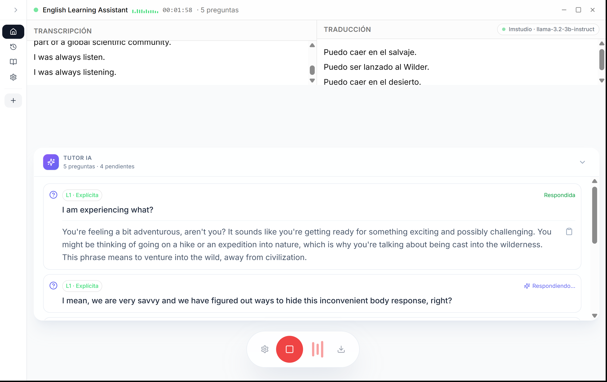
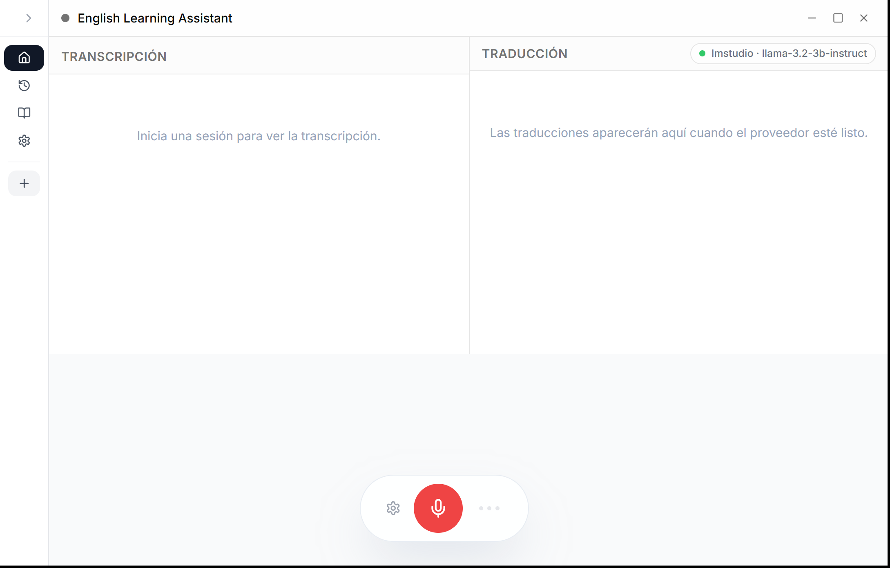
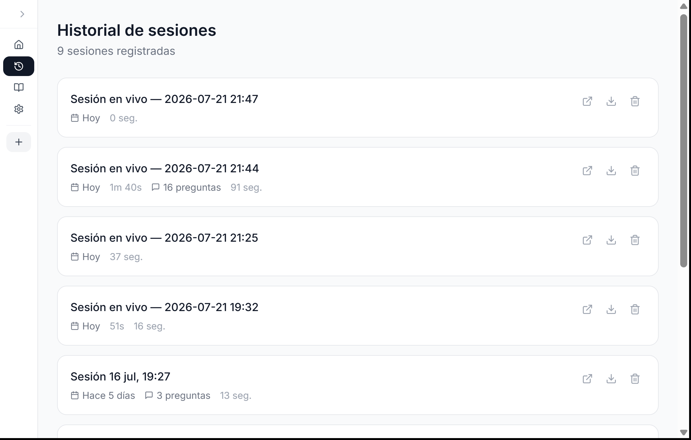
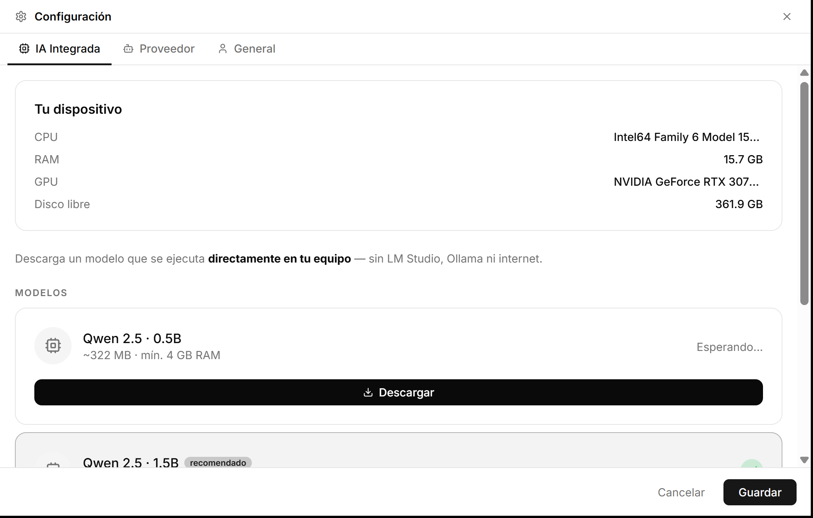
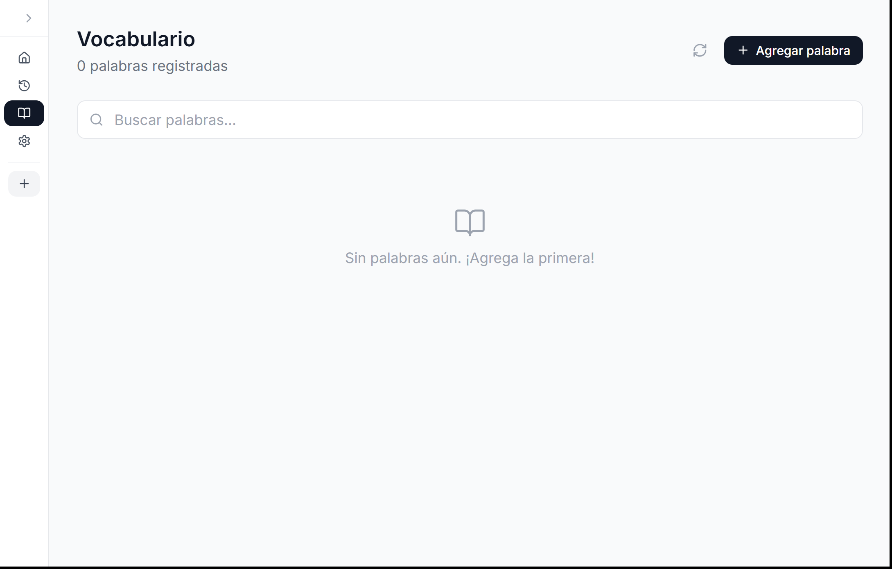

# English Learning Assistant

[](https://github.com/CharlieCardenasToledo/english-learning-assistant/releases)
[](https://tauri.app/)
[](https://nextjs.org/)
[](https://dotnet.microsoft.com/)
[](https://www.typescriptlang.org/)
[](LICENSE)
[](https://www.microsoft.com/windows)

> Asistente de IA en tiempo real para estudiantes de inglés. Captura los subtítulos de Windows Live Captions, traduce al español automáticamente, detecta preguntas y genera sugerencias de respuesta — todo ejecutándose localmente en tu equipo.

**[English](README.md) | Español**

---



---

## Cómo funciona

English Learning Assistant corre como una app de escritorio nativa (construida con Tauri v2 + Next.js). Lee el texto que Windows Live Captions está transcribiendo y:

1. **Muestra** la transcripción en inglés en tiempo real
2. **Traduce** cada oración al español automáticamente
3. **Detecta** preguntas mediante una cascada de 4 niveles (L1–L4)
4. **Genera** sugerencias de respuesta con IA en ambos idiomas

Todo corre de forma local — ningún dato sale de tu equipo.

---

## Capturas de pantalla

| Vista principal | Historial de sesiones |
|-----------------|----------------------|
|  |  |

| Configuración — IA Integrada | Gestor de vocabulario |
|------------------------------|----------------------|
|  |  |

---

## Funcionalidades

### Transcripción y traducción en tiempo real
- Lee Windows Live Captions mediante UI Automation — no requiere procesamiento de audio
- Traduce cada oración confirmada al español
- Tres proveedores de traducción: **IA Integrada** (sin servidor externo), **LM Studio**, **Ollama**
- Entrada de micrófono como fuente secundaria mediante Whisper

### Detección inteligente de preguntas
- **L1** — Signo de interrogación explícito (confianza 0.95)
- **L2** — Palabra WH o verbo auxiliar al inicio (0.80–0.85)
- **L2b** — Preguntas de coletilla como "right?", "isn't it?" (0.85)
- **L3** — Iniciadores indirectos como "I wonder…", "I'd like to know…" (0.70)
- **L4** — Clasificador LLM para casos ambiguos (0.75)
- Detección de nombre: aumenta la confianza cuando tu nombre aparece en la oración

### Sugerencias de respuesta con IA
- Genera respuestas contextuales adaptadas a tu nivel MCER (A2–C1)
- Transmite tokens en tiempo real — las respuestas aparecen mientras se generan
- Compatible con IA Integrada, LM Studio u Ollama

### IA Integrada (sin servidor externo)
- Descarga un modelo directamente desde Configuración — corre completamente dentro de la app
- Impulsado por [LLamaSharp](https://github.com/SciSharp/LLamaSharp) (bindings de llama.cpp para .NET)
- Modelos soportados: Qwen 2.5 (0.5B, 1.5B, 3B, 7B) — recomendado: 1.5B para la mayoría de equipos

### Gestión de sesiones
- Cada clase se guarda como sesión en una base de datos SQLite local
- Las sesiones incluyen transcripción, preguntas detectadas y duración
- Exporta cualquier sesión a Markdown
- Retoma o revisa sesiones anteriores desde el historial

### Gestor de vocabulario
- Agrega palabras con traducción, definición y nivel MCER
- Busca y elimina entradas

---

## Requisitos

| Componente | Detalles |
|------------|---------|
| **SO** | Windows 10 22H2+ o Windows 11 |
| **Windows Live Captions** | Activa con `Win + Ctrl + L` |
| **Proveedor de IA** | IA Integrada (sin instalación), LM Studio u Ollama — se requiere al menos uno |

> **No necesitas Rust ni Node.js para ejecutar la app.** Solo son necesarios para compilar desde el código fuente.

---

## Primeros pasos

### Opción A — Descargar el instalador (recomendado)

Ve a [Releases](https://github.com/CharlieCardenasToledo/english-learning-assistant/releases) y descarga el último instalador `.exe`.

### Opción B — Compilar desde el código fuente

**Requisitos previos:** [Node.js 20+](https://nodejs.org/), [pnpm](https://pnpm.io/), [Rust (stable)](https://rustup.rs/), [.NET 8 SDK](https://dotnet.microsoft.com/download)

```bash
git clone https://github.com/CharlieCardenasToledo/english-learning-assistant.git
cd english-learning-assistant
pnpm install
pnpm tauri dev      # desarrollo (hot reload)
pnpm tauri build    # build de producción
```

`pnpm tauri dev` automáticamente:
1. Compila el plugin .NET (`EnglishLearningAssistant.TauriPlugIn`)
2. Inicia el servidor de desarrollo Next.js
3. Abre la ventana Tauri

### Primera ejecución

En el **primer inicio**, un asistente de configuración te guía:
1. Elegir un proveedor de IA (Integrada, LM Studio u Ollama)
2. Descargar un modelo si usas IA Integrada
3. Configurar tu nivel de inglés (A2–C1) y nombre de usuario

### Activar Windows Live Captions

Presiona `Win + Ctrl + L` — aparece una barra de subtítulos. La app la lee automáticamente.

---

## Arquitectura

```
english-learning-assistant/
├── src/                          # Frontend Next.js (React + TypeScript)
│   ├── app/                      # Páginas: principal, sesiones, vocabulario, configuración
│   ├── components/               # Componentes UI (TranscriptionPanel, QuestionPanel…)
│   ├── hooks/                    # useCaptionEvents, useTauriInvoke
│   └── types/                    # Tipos TypeScript compartidos
├── src-tauri/                    # Shell Tauri v2 (Rust)
│   ├── src/                      # Punto de entrada Rust + tauri-dotnet-bridge
│   └── capabilities/             # Modelo de permisos Tauri
├── src-dotnet/
│   └── EnglishLearningAssistant.TauriPlugIn/   # Plugin .NET 8 HTTP/SignalR
│       ├── Controllers/          # Endpoints REST (sesión, configuración, vocabulario, IA)
│       ├── Providers/            # Traducción: LmStudio, Ollama, LocalLlama
│       └── Services/             # BuiltInAiService, CaptionHostedService
└── EnglishLearningAssistant.Core/              # Lógica compartida (librería de clases .NET)
    ├── Application/Sessions/     # SessionOrchestrator — pipeline de detección de preguntas
    └── Services/                 # LmStudioService, QuestionDetectionService…
```

El shell Tauri aloja un runtime .NET 8 mediante [`tauri-dotnet-bridge`](https://crates.io/crates/tauri-dotnet-bridge-host). El frontend se comunica con el plugin .NET a través de una conexión SignalR local. El texto de Live Captions se lee mediante UI Automation.

---

## Proveedores de IA

| Proveedor | Configuración | Notas |
|-----------|--------------|-------|
| **IA Integrada** | Descarga el modelo desde Configuración | Sin servidor externo. Ideal para uso sin conexión. |
| **LM Studio** | Inicia el servidor en el puerto 1234 | Compatible con cualquier modelo GGUF |
| **Ollama** | `ollama serve` | Compatible con cualquier modelo Ollama |

---

## Solución de problemas

**El panel de transcripción está vacío**
Activa Windows Live Captions con `Win + Ctrl + L`. Si no aparece nada en 10 segundos, desactiva y vuelve a activar los subtítulos.

**La traducción no funciona**
Ve a Configuración → Proveedor y verifica que tu proveedor de IA esté corriendo. Para IA Integrada, comprueba que haya un modelo descargado.

**LM Studio no conecta**
Abre LM Studio, carga un modelo y arranca el servidor local en el puerto 1234.

**No se detectan preguntas**
La cascada requiere al menos 3 palabras. Los fragmentos cortos se acumulan hasta que se confirma una oración completa.

---

## Contribuir

1. Haz un fork del repositorio
2. Crea una rama: `git checkout -b feat/tu-funcionalidad`
3. Ejecuta las pruebas: `dotnet test tests/`
4. Crea un commit con un mensaje claro y abre un Pull Request

---

## Licencia

[MIT](LICENSE) — Charlie Cardenas Toledo, 2026
