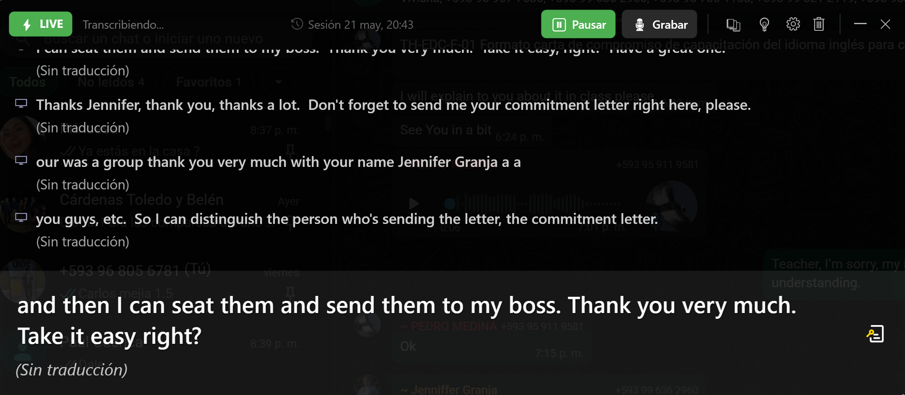

# English Learning Assistant

[](https://dotnet.microsoft.com/)
[](https://docs.microsoft.com/en-us/dotnet/desktop/wpf/)
[](https://lmstudio.ai/)
[](LICENSE)
[](https://www.microsoft.com/windows)

> Real-time AI assistant for English learners. Captures live captions, translates to Spanish automatically, detects teacher questions, and generates contextual response suggestions — all running locally on your machine.

**English | [Español](README.es.md)**

---



---

## How it works

The app runs as a transparent overlay on top of any other window (Zoom, Teams, your browser). It reads the text that Windows Live Captions is transcribing and:

1. **Displays** the English transcription in real time (top-left)
2. **Translates** each sentence to Spanish automatically (top-right)
3. **Detects** when the teacher asks a question using a 4-level cascade (bottom-left)
4. **Generates** 3 response options in English + Spanish via LM Studio (bottom-right)

Everything runs locally — no data leaves your machine.

---

## Features

### Real-time transcription and translation
- Reads Windows Live Captions via UI Automation — no audio processing required
- Auto-translates every committed sentence to Spanish using LM Studio
- Fallback to LibreTranslate (local server) when available for faster translation
- Manual microphone input as a secondary source

### Intelligent question detection
- **L1** — Explicit question mark (confidence 0.95)
- **L2** — WH-word or auxiliary verb at sentence start (0.80–0.85)
- **L2b** — Tag questions like "right?", "isn't it?" (0.85)
- **L3** — Indirect starters like "I wonder…", "I'd like to know…" (0.70)
- **L4** — LM Studio classifier for ambiguous cases (0.75)
- Username detection: boosts confidence when your name appears in the sentence
- Fragmentation retry: combines current and previous sentence when detection is uncertain

### AI response suggestions
- Generates exactly 3 numbered options tailored to your CEFR level (A2–C1)
- All options in English; Spanish translation rendered side-by-side
- Context-aware: uses the last 15 lines of transcription as background
- Streams tokens in real time — no waiting for the full response

### Session management
- Every class is saved as a session in a local SQLite database
- Sessions include transcription entries, detected questions, and AI-generated summaries
- Resume a previous session with a single click
- Export any session to Markdown

### Vocabulary manager
- Add words with translation, definition, and CEFR level
- Analyze clipboard text to extract vocabulary automatically
- Search and delete entries

---

## Requirements

| Component | Details |
|-----------|---------|
| **OS** | Windows 10 22H2+ or Windows 11 (Live Captions requires this) |
| **.NET** | .NET 8.0 runtime or SDK |
| **LM Studio** | Any version — must be running with a model loaded |
| **Windows Live Captions** | Enable with `Win + Ctrl + L` |

LM Studio is the only external dependency. Whisper is optional for microphone transcription and is not required for the main workflow.

---

## Getting started

### 1. Clone and build

```bash
git clone https://github.com/CharlieCardenasToledo/WindowsLiveCaptionsRead.git
cd WindowsLiveCaptionsRead
dotnet build
dotnet run
```

### 2. Start LM Studio

Open LM Studio, load any model (Gemma, Llama, Mistral, etc.), and start the local server. The app detects it automatically.

### 3. Enable Windows Live Captions

Press `Win + Ctrl + L` — a caption bar appears at the top or bottom of your screen. The app reads from it via UI Automation.

### First run vs. subsequent runs

On the **first run**, a setup wizard checks your LM Studio connection and lets you optionally download a Whisper model for microphone input. On **subsequent runs**, the wizard is skipped and the app opens directly in the overlay.

---

## UI layout

```
┌──────────────────────────────────────────────────────────────────┐
│  LIVE  Sesión 21 may, 14:03          [Asistente] [Vocab] [Mic]  │
├──────────────────────────┬───────────────────────────────────────┤
│  EN  TRANSCRIPCIÓN       │  ES  TRADUCCIÓN                       │
│                          │                                       │
│  Live captions text      │  Traducción automática                │
│  appears here in         │  aparece aquí en                      │
│  real time               │  tiempo real                          │
├──────────────────────────┼───────────────────────────────────────┤
│  PREGUNTA DETECTADA      │  OPCIONES DE RESPUESTA                │
│                          │  EN                                   │
│  ❓ 85%  Question text   │  1. First option...                   │
│                          │  2. Second option...                  │
│  CONTEXTO                │  3. Third option...                   │
│  Context from class      │  ES                                   │
│                          │  1. Primera opción...                 │
│  [Manual input box  →]   │  2. Segunda opción...                 │
├──────────────────────────┴───────────────────────────────────────┤
│  [Traducir]  [Limpiar]  [Resumen]                               │
└──────────────────────────────────────────────────────────────────┘
```

The window is a full-screen transparent overlay. Drag by the header to move. Adjust opacity in Settings.

---

## Keyboard shortcuts

| Shortcut | Action |
|----------|--------|
| `Ctrl + Space` | Toggle AI Assistant panel |
| `Ctrl + T` | Translate full transcription manually |
| `Ctrl + M` | Pause / Resume Live Captions capture |
| `Ctrl + Shift + C` | Clear all panels |
| `Esc` | Close any open overlay (Settings / Sessions / Assistant) |
| `Win + Ctrl + L` | Toggle Windows Live Captions (system shortcut) |

---

## Project structure

```
WindowsLiveCaptionsReader/
├── Services/
│   ├── CaptionReader.cs              # UI Automation reader for Live Captions
│   ├── CaptionPipeline.cs            # Sentence accumulation state machine
│   ├── LmStudioService.cs            # LM Studio API client (OpenAI-compatible)
│   ├── QuestionDetectionService.cs   # 4-level detection cascade (L1–L4)
│   ├── SessionService.cs             # SQLite session persistence (EF Core)
│   ├── VocabularyService.cs          # Vocabulary CRUD
│   ├── AudioCaptureService.cs        # Microphone input (NAudio)
│   ├── LibreTranslateService.cs      # Local LibreTranslate fallback
│   ├── WhisperService.cs             # Optional Whisper transcription
│   └── AppLogger.cs                  # File-based logger
├── Models/                           # EF Core entities
├── MainWindow.xaml / .cs             # 4-quadrant overlay
├── SetupWindow.xaml / .cs            # First-run wizard
├── VocabularyWindow.xaml / .cs       # Vocabulary manager
└── WindowsLiveCaptionsReader.Tests/  # xUnit test suite (36 tests, L1–L3)
```

---

## Architecture note

Question detection and AI generation are decoupled via a bounded `Channel<QuestionJob>`:

```
CaptionPipeline.Feed()
  └── ProcessSentenceAsync()     L1-L3 regex detection (<1 ms, no LLM)
        ├── confidence >= 0.70   cancel in-flight generation, enqueue
        ├── confidence 0.60-0.69 show badge, run L4-AI via TryWrite
        └── not a question       discard

Channel<QuestionJob> (capacity=1, DropOldest)
  └── RunQuestionWorkerAsync()   single consumer, lifetime of window
        └── GenerateResponseAsync() streams context + EN options + ES translation
```

A new high-confidence question always cancels the current generation. L4-AI results never interrupt an ongoing response.

---

## Configuration

Settings are saved to `%LOCALAPPDATA%\EnglishLearningAssistant\settings.json`:

```json
{
  "userName": "Charlie",
  "englishLevel": "B1",
  "lmStudioModel": "google/gemma-4-e4b"
}
```

Change name, level, and model via the **Settings** panel in the app. No restart required.

---

## Troubleshooting

**Nothing appears in the transcription panel**
Enable Windows Live Captions with `Win + Ctrl + L`. The app reads from the captions window via UI Automation — if nothing appears after 10 seconds, try toggling captions off and on.

**LM Studio not connecting**
Open LM Studio, load a model, start the local server, then click the refresh button next to the model selector in Settings.

**Question not detected**
The cascade requires at least 3 words. For ambiguous cases, type the question manually in the input box at the bottom of the "Pregunta detectada" panel and press Enter.

**Translation not appearing**
Translation runs automatically on each committed sentence. Check the status label next to "TRADUCCIÓN" for error messages.

---

## Contributing

1. Fork the repository
2. Create a feature branch: `git checkout -b feat/your-feature`
3. Run the test suite: `dotnet test WindowsLiveCaptionsReader.Tests/`
4. Commit with a clear message and open a Pull Request

---

## License

[MIT](LICENSE) — Charlie Cardenas Toledo, 2026
